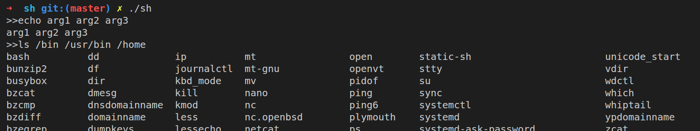

# 文件读写编程题目

## myecho.c

> - myecho.c的功能与系统echo程序相同
> - 接受命令行参数，并将参数打印出来

source code

```c
#include <stdio.h>

int main(int argc, char *argv[])
{
    // printf("arguments number is : %d\n", argc - 1);
    int i;
    for (i = 1; i < argc; i++)
    {
        printf("%s ", argv[i]);
    }
    printf("\n");
    return 0;
}

```
argc代表命令行中参数个数, 包括文件名本身(第0个参数). argv则包含命令行的输入. 可以使用一个loop按顺序输出


## mycat.c

> - mycat.c的功能与系统cat程序相同
> - mycat将指定的文件内容输出到屏幕，例子如下：
> - 要求使用系统调用open/read/write/close实现

core code

```c
    file = open(path, O_RDONLY);
    if (file == -1)
    {
        printf("unable to open %s", argv[1]);
    }
    char *buf[100000];
    int length;
    length = read(file, buf, 100000);
    if (length != -1)
    {
        printf("%s", buf);
        // printf("%d", length);
    }
```

将argv第1个参数, 也就是文件名读入, 然后打开, 读入到字符数组并输出


## mycp.c

> - mycp.c的功能与系统cp程序相同
> - 将源文件复制到目标文件，例子如下：
> - 要求使用系统调用open/read/write/close实现

core code1

```c
     char *path = argv[1];
     int file;
      file = open(path, O_RDONLY);
      if (file == -1) {
          printf("unable to open %s", argv[1]);
      }
      char *buf[100000];
      int length;
```

现从argv[1]对应的文件路径中读入文件, 这里的length会得到read的返回值: **实际读取的字节个数**, 便于后面重新写到新的文件中.

```c
      length = read(file, buf, 100000);
      if (length != -1){
          // printf("%s", buf);
          int file_to_write;
          file_to_write =  open(argv[2], O_WRONLY | O_CREAT | O_TRUNC);
          if (write(file_to_write, buf, length) != -1) {
              printf("finish write file!!!");
          }
          else {
              printf("unable to write %s", argv[2]);
          }
          close(file_to_write);
```

file_to_write即是待写入的文件, 写入length字节长的buf, 注意这里的length很关键, 不然会有乱码,  因为读入的buf超过了原文件本身.


# 多进程题目

## mysys.c: 

> - 实现函数mysys，用于执行一个系统命令，要求如下
> - mysys的功能与系统函数system相同，要求用进程管理相关系统调用自己实现一遍
> - 使用fork/exec/wait系统调用实现mysys
> - 不能通过调用系统函数system实现mysys

**core** code

```c
    if ((pid = fork()) < 0)
    {
        status = -1;
    }
    else if (pid == 0)
    {
        execl("/bin/sh", "sh", "-c", cmdstring, NULL);
        _exit(127);
    }
    else
    {
        while (waitpid(pid, &status, 0) < 0)
        {
            if (errno != EINTR)
            {
                status = -1;
                break;
            }
        }
    }
```

这里调用fork()后, 创建一个子进程，父子进程并发运行, 子进程返回0, 进入第一个分支, 调用execl, 参数是主函数传来需要执行的命令, 父进程返回的子进程PID, 不是零, 进入下一条分支, 等待子进程执行完, 结束程序.


## sh1.c

> * 实现shell程序，要求具备如下功能
> * 支持命令参数
> * 实现内置命令cd、pwd、exit

core code 1

```c
void split(char buf[], char *array[]) {
    int i = 0;
    char *p = strtok(buf, " ");

    while (p != NULL) {
        array[i++] = p;
        p = strtok(NULL, " ");
    }
    for (; i < N_ARRAY; i++) {
        array[i] = NULL;
    }
}

```

用于切分字符串buf, 以空格为界, 存入新的字符指针数组array.

core code 2

```c
    while (1) {
        char command[LEN];
        char *array[N_ARRAY];

        printf("%s", ">>");
        fgets(command, sizeof(command), stdin);
        command[strlen(command) - 1] = '\0'; // ignore newline!!!
        strcpy(command_fix, command);
        split(command, array);
        /*for (int j = 0; j < 10; j++) {
            printf("***%s***%d \n", array[j], array[j] == NULL);
        }*/
        if (-1 == execute(array))
            return 0;
    }
```

为了构造类似shell的环境, 需要进入一个无限循环, 直到输入exit, execute函数返回-1时, 才会退出. 循环内split输入命令, 调用execute函数来执行.

core code 3

```c
    if (strcmp(array[0], "echo") == 0) {
        int pid = fork();
        if (pid == 0) {
            execl("/bin/sh", "sh", "-c", command_fix, NULL);
        } else {
            int status;
            wait(&status);
        }
    } else if (strcmp(array[0], "ls") == 0) {
        int pid = fork();
        if (pid == 0) {
            if (array[1] == NULL) {
                execlp("/bin/ls", "ls", "./", NULL, NULL, NULL);
            } else {
                execlp("/bin/ls", "ls", array[1], NULL, NULL, NULL);
            }
        } else {
            int status;
            wait(&status);
        }
    } else if (strcmp(array[0], "exit") == 0) {
        return -1;
    } else if (strcmp(array[0], "cd") == 0) {
        chdir(array[1]);
    } else if (strcmp(array[0], "pwd") == 0) {
        int pid = fork();
        if (pid == 0) {
            printf("test pwd!!!\n");
            system("pwd");
        } else {
            int status;
            wait(&status);
        }
    }
```

以上使用实现了echo, ls, exit, cd, pwd的功能, 每个功能实现流程都是如下:

* 对分割后的array数组中的第一个字符串判断, 是否是要实现的功能
* 若是则使用fork(), 创建子线程实现
* 主线程等待子线程结束

运行截图



## sh2.c: 

> * 实现shell程序，要求在第1版的基础上，添加如下功能
>
> - 实现文件重定向

在上一题基础上, 添加部分代码, 以下是核心部分:

```c

```

# 多线程题目

## pi1.c: 

> - 使用2个线程根据莱布尼兹级数计算PI
> - 莱布尼兹级数公式: 1 - 1/3 + 1/5 - 1/7 + 1/9 - ... = PI/4
> - 主线程创建1个辅助线程
> - 主线程计算级数的前半部分
> - 辅助线程计算级数的后半部分
> - 主线程等待辅助线程运行結束后,将前半部分和后半部分相加

core code 1

```c
float res = 0;
struct arg_struct {
    int arg1;
    int arg2;
};
```

这里的float型res是最终结果存放的位置, 全局变量. arg_struct则是定义的结构体, 作为存放线程的**参数**.

core code 2

```c
void *compute(void *arg) {
    struct arg_struct *me;
    me = (struct arg_struct *) arg;
    int start = me->arg1;
    int end = me->arg2;
    for (; start <= end; start++)
        res += powf(-1, start + 1) / (2 * start - 1);
}
```

首先将参数转换为定义的参数类型, 解析出起始和结束的序列号, 按公式计算并加到res中.

core code3

```c
    pthread_t worker_tid;
    struct arg_struct *parent = malloc(sizeof(struct arg_struct));
    struct arg_struct *child = malloc(sizeof(struct arg_struct));
    parent->arg1 = 1;
    parent->arg2 = n / 2;
    child->arg1 = n / 2 + 1;
    child->arg2 = n;
    pthread_create(&worker_tid, NULL, &compute, child);
    compute(parent);
    pthread_join(worker_tid, NULL);
```

以上定义了父子线程的参数, 并创建子线程, 父线程同时执行compute, 等待子线程结束.

运行截图


## pi2.c: 

> - 使用N个线程根据莱布尼兹级数计算PI
> - 与上一题类似，但本题更加通用化，能适应N个核心，需要使用线程参数来实现
> - 主线程创建N个辅助线程
> - 每个辅助线程计算一部分任务，并将结果返回
> - 主线程等待N个辅助线程运行结束，将所有辅助线程的结果累加

本题相较于上一题, 线程数量变多, 需要使用数组来存放线程id与线程参数, 需要使用循环来对参数初始化并创建线程, 并且线程需要返回值

core code 1

```c
struct arg_struct {
    int start;
    int end;
};
struct result {
    float sum;
};
```

以上是定义的参数结构题, 返回值的结构体

core code 2

```c
    pthread_t workers[NR_CPU];
    struct arg_struct args[NR_CPU];
    int p = 1;
    for (i = 0; i < NR_CPU; i++) {
        struct arg_struct *arg;
        arg = &args[i];
        arg->start = p;
        if (p + n / NR_CPU - 1 <= n) {
            arg->end = p + n / NR_CPU - 1;
        } else {
            arg->end = n;
            break;
        }
        pthread_create(&workers[i], NULL, &compute, arg);
        p += (n / NR_CPU);
    }
```

这里workers数组存放多个线程id, arg_struct数组存放每个线程的参数, 使用下方的循环做初始化, 即找到每个线程中计算$\pi$值的开始和结束序列号, 并且创建线程.

core code 3

```c
void *compute(void *arg) {
    struct arg_struct *me;
    me = (struct arg_struct *) arg;
    int start = me->start;
    int end = me->end;
    float sum = 0;
    for (; start <= end; start++)
        sum += powf(-1, start + 1) / (2 * start - 1);
    struct result *res;
    res = malloc(sizeof(struct result));
    res->sum = sum;
//    printf("**  %f\n", res->sum);
    return res;
}
```

定义计算$\pi$值的函数, 在上题基础上增加返回值功能.

core code 4

```c
    float sum = 0;
    for (i = 0; i < NR_CPU; i++) {
        struct result *result;
        pthread_join(workers[i], (void **) &result);
        sum += result->sum;
//        printf("result->sum = %d\n", result->sum);
        free(result);
    }
```

线程同步, 用一个循环确保每个子线程都结束运行, 并且返回值存在result中, 累加得到的sum即为$\pi/4$.

运行截图:


## pc1.c: 

> - 使用条件变量解决生产者、计算者、消费者问题
> - 系统中有3个线程：生产者、计算者、消费者
> - 系统中有2个容量为4的缓冲区：buffer1、buffer2
> - 生产者生产'a'、'b'、'c'、‘d'、'e'、'f'、'g'、'h'八个字符，放入到buffer1
> - 计算者从buffer1取出字符，将小写字符转换为大写字符，放入到buffer2
> - 消费者从buffer2取出字符，将其打印到屏幕上

这个题重点在于弄清生产者, 计算者, 消费者的运行逻辑以及互斥关系, 计算者要从生产者存放item的buffer1中get item, 并进行计算, 大小写转换后放入buffer2, 消费者从buffer2中再读取利用.